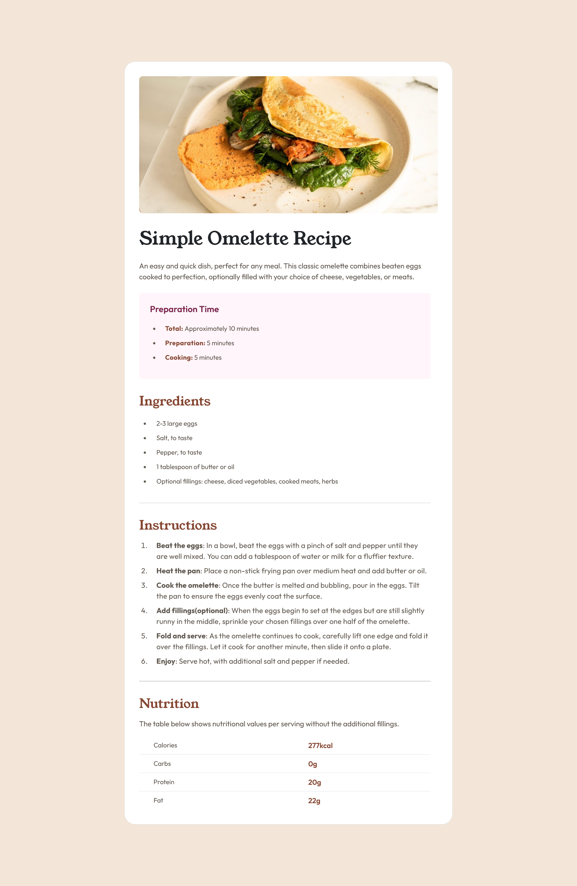

## Table of contents

-   [Overview](#overview)
-   [The challenge](#the-challenge)
-   [Screenshot](#screenshot)
-   [Links](#links)
-   [Built with](#built-with)
-   [Author](#author)

## Overview

This challenge is designed based on the provided template from Frontend Mentor which help us improve our coding skills by building realistic projects.

### Screenshot

### Links

-   Solution URL: [Recipe Page](https://github.com/Albrt78/recipepage.github.io)
-   Live Site URL: [Recipe Page](https://albrt78.github.io/recipepage.github.io/)

### Built with

-   Semantic HTML5 markup
-   CSS custom properties
-   CSS GRID
-   [Bootstrap5](https://getbootstrap.com) - CSS framework

## Author

-   Frontend Mentor - [@Albrt78](https://www.frontendmentor.io/profile/Albrt78)
